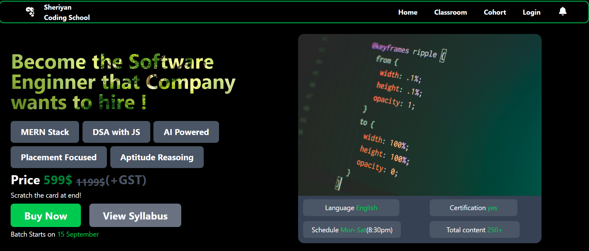

```
# 🚀 Sheriyan Coding School Landing Page
```

```
> 🚀 My **first Tailwind CSS project** built while learning Tailwind's utility-
first approach.
```

```
A modern landing page inspired by the **Sheriyan Coding School** website. This
project helped me explore Tailwind CSS by building an attractive UI without
writing custom CSS.
```

```
---
```

```
## 🚀 Project Preview
```

```
<p align="center">
```

```
  
</p>
```

```
---
```

```
## 🚀 Features
```

- `🚀 Modern dark-themed UI - Background image inside text using `bg-clip-text`` 🖼️� 

- `- 🚀 Interactive hover effects on buttons and navigation links` 

- `Smooth transitions and scaling animations⚡` 

- `🚀 Custom glowing button shadow` 

- `🚀 Flexbox-based layout - Stylish course tags` 🏷️� 

- `-` 💰 `Attractive pricing section - Rounded information cards` 🖼️� 

- `🚀 Font Awesome icons` 

```
---
```

`## Tech Stack` 🛠️� 

```
- HTML5
- Tailwind CSS
```

- `Font Awesome` 

```
---
```

```
## 🚀 Folder Structure
```

```
```text
Sheriyan Landing Page/
│
├── index.html
├── README.md
├── preview.png
├── download.png
├── ii.jfif
└── pankaj-patel-SXihyA4oEJs-unsplash.jpg
```
```

```
---
```

`##` 📚 `What I Learned` 

- `Building layouts using Tailwind CSS` 

- `Creating responsive sections with Flexbox` 

- `Using `bg-clip-text` for image-filled text` 

- `Applying hover effects and smooth transitions` 

- `Creating modern UI components using utility classes` 

- `Designing without writing custom CSS` 

```
---
```

```
## 🚀 Future Improvements
```

- `🚀 Make the page fully responsive` 

- `🚀 Add Dark/Light mode toggle` 

- 📋 `Add a mobile navigation menu` 

- 🎬 `Add more animations` 

- `🚀 Deploy with GitHub Pages` 

```
---
```

# `##` 💻 `Run Locally` 

`1. Clone the repository` 

```
```bash
```

```
git clone https://github.com/Huzai1fa/web-development.git
```
```

`2. Open the project folder.` 

`3. Launch `index.html` in your browser.` 

```
---
```

`##` �💻 `Author` 

```
**Huzaifa Saeed**
```

```
This project marks the beginning of my Tailwind CSS journey. I'm excited to keep
building modern, responsive, and interactive web applications.
```

```
---
```

`###  If you like this project, consider giving it a star!` ⭐ 

